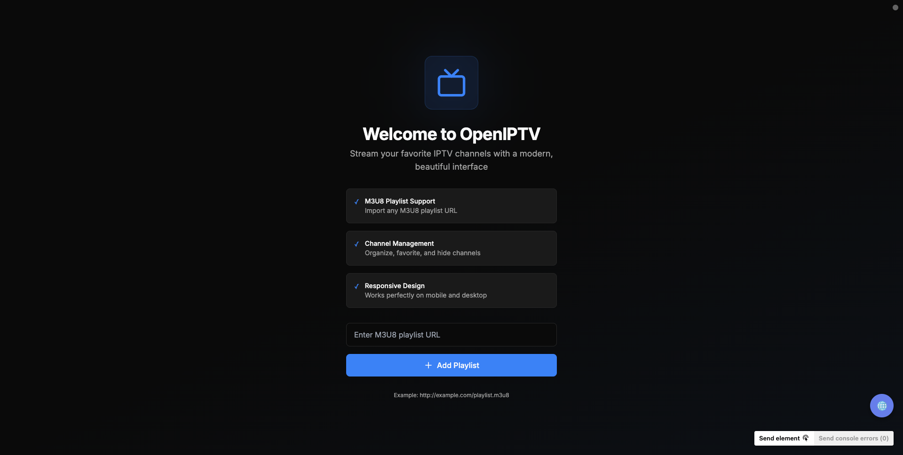
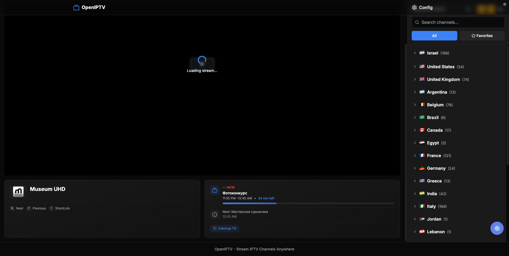

# OpenIPTV - Modern IPTV Streaming Platform

A beautiful, open-source web application for streaming and managing IPTV channels from M3U8 playlists.


> **Note:** This project was created mostly through vibe coding with AI assistance. It demonstrates what's possible when combining human creativity with AI-powered development.

## 📸 Screenshots


*Welcome screen - Add your M3U8 playlist to get started*


*Channel list with video player*

## ✨ Features

### Core Features

- 📺 **M3U/M3U8 Playlist Support** - Import and manage multiple IPTV playlists
- 🎬 **Multi-Protocol Streaming** - HLS, RTMP, RTSP, HTTP streams with hls.js
- ⭐ **Channel Management** - Organize, favorite, search, and hide channels
- 📱 **Fully Responsive** - Perfect experience on mobile, tablet, and desktop
- 🎨 **Modern UI** - Beautiful dark mode interface with smooth animations
- 💾 **Local Storage** - All data stored locally in IndexedDB


- 🕐 **Continue Watching** - Resume from your watch history
- ⌨️ **Keyboard Shortcuts** - Full keyboard navigation (press `?` for help)
- 📺 **Channel Info Overlay** - Auto-displaying channel info on switch
- 🔊 **Volume Memory** - Remembers your volume preferences
- ⏭️ **Auto-Play Next** - Binge-watching mode with countdown
- 🎯 **Smart Loading** - Skeleton animations for smooth transitions
- 🔔 **Toast Notifications** - Beautiful feedback for all actions

### Advanced Features

- 📡 **Chromecast Support** - Cast streams to your TV
- 📋 **EPG Support** - Electronic Program Guide with search
- ⏪ **Catchup/Timeshift** - Watch past programs (provider-dependent)
- 🎥 **Recording** - Record streams directly in browser
- 🖼️ **Picture-in-Picture** - Watch while multitasking
- 📁 **Custom Folders** - Organize channels into custom categories
- 🔄 **Auto-Refresh** - Keep playlists up to date automatically
- 🌍 **Country Grouping** - Channels organized by country
- 🔍 **Smart Search** - Quickly find channels by name or category
- 🎯 **Grid/List Views** - Choose your preferred channel display mode
- 🎬 **VOD Detection** - Automatic movie/series detection from playlists

### Personalization

- 🔢 **Channel Numbers** - Display channel numbers for easy navigation
- 🎨 **Themes & Accent Colors** - Customize appearance with multiple accent colors
- 🔒 **Parental Controls** - PIN-protected channel and group blocking
- 📊 **Watch Statistics** - Track your viewing habits and top channels
- 💾 **Backup/Restore** - Export and import all your settings
- 📺 **Last Channel Resume** - Auto-resume last watched channel on startup
- 😴 **Sleep Timer** - Auto-stop playback after set duration
- 🎚️ **Buffer Settings** - Customize buffer length for smooth playback
- 📝 **Subtitle/Audio Preferences** - Set preferred languages
- 📈 **Stream Info Overlay** - View codec, bitrate, and resolution

## 🚀 Getting Started

### Prerequisites

- Node.js 18+ or npm/yarn/pnpm

### Installation

1. **Clone the repository**
   ```bash
   git clone https://github.com/chikosan/openiptv.git
   cd openiptv
   ```

2. **Install dependencies**
   ```bash
   npm install
   # or
   yarn install
   # or
   pnpm install
   ```

3. **Run the development server**
   ```bash
   npm run dev
   # or
   yarn dev
   # or
   pnpm dev
   ```

4. **Open your browser**
   Navigate to [http://localhost:3000](http://localhost:3000)

### 🐳 One-Click Docker Install

```bash
git clone https://github.com/chikosan/openiptv.git && cd openiptv && docker-compose up -d
```

Or run directly without cloning:

```bash
docker run -d -p 3000:3000 --name openiptv ghcr.io/chikosan/openiptv:latest
```

Access the app at [http://localhost:3000](http://localhost:3000)

## 📖 Usage

### Adding a Playlist

1. On first launch, you'll see the welcome screen
2. Enter your M3U8 playlist URL (e.g., `http://example.com/playlist.m3u8`)
3. Click "Add Playlist" and wait for channels to load
4. Start watching!

### Managing Channels

- **Search**: Use the search bar to find channels quickly
- **Favorites**: Click the star icon to add channels to favorites
- **View Modes**: Switch between grid and list views
- **Filters**: Filter by all channels or favorites only

### Playback Controls

- **Play/Pause**: Click the video or use spacebar
- **Volume**: Use volume slider or up/down arrow keys
- **Fullscreen**: Click fullscreen button or press 'F'
- **Quality**: Video.js automatically adapts quality based on your connection

## 🛠️ Tech Stack

### Frontend
- **Framework**: Next.js 14 (App Router)
- **UI Library**: React 18
- **Language**: TypeScript
- **Styling**: TailwindCSS + shadcn/ui
- **State Management**: Zustand
- **Video Player**: hls.js (streaming) + Video.js (UI controls)
- **Data Fetching**: TanStack Query (React Query)
- **Icons**: Lucide React
- **Animations**: Framer Motion

### Storage
- **Primary**: IndexedDB (via native API)
- **Fallback**: localStorage

## 📁 Project Structure

```text
openiptv/
├── app/                    # Next.js app directory
│   ├── api/               # API routes (proxy)
│   ├── layout.tsx         # Root layout
│   ├── page.tsx           # Home page
│   └── globals.css        # Global styles
├── components/            # React components
│   ├── channels/          # Channel list components
│   ├── layout/            # Layout components
│   ├── player/            # Video player components
│   ├── settings/          # Settings modal
│   └── welcome-screen.tsx # Welcome screen
├── lib/                   # Utilities and logic
│   ├── store/             # Zustand stores
│   ├── recording/         # Recording functionality
│   ├── epg/               # EPG management
│   ├── m3u8-parser.ts     # M3U8 playlist parser
│   ├── storage.ts         # IndexedDB wrapper
│   └── types.ts           # TypeScript types
├── public/                # Static assets & PWA
└── package.json           # Dependencies
```

## 🔧 Configuration

### Environment Variables

Currently, no environment variables are required. All data is stored locally.

### Customization

#### Changing Theme Colors

Edit `app/globals.css` to customize the color scheme:

```css
:root {
  --primary: 217.2 91.2% 59.8%; /* Blue */
  --secondary: 262.1 83.3% 57.8%; /* Violet */
  --accent: 38.4 96.1% 50%; /* Amber */
}
```

## 📱 PWA Support

OpenIPTV supports Progressive Web App features:

- [x] Install on home screen
- [x] App-like experience
- [x] SVG icons for crisp display
- [ ] Offline channel list access
- [ ] Push notifications

## 🎯 Roadmap

### Phase 1 - MVP ✅ Complete

- [x] M3U8 playlist import
- [x] Channel list with search
- [x] Video player with HLS support
- [x] Favorites management
- [x] Responsive design
- [x] Dark mode UI
- [x] Grid/List view modes
- [x] Country-based channel grouping

### Phase 2 - Enhancement ✅ Complete

- [x] PWA support with SVG icons
- [x] Improved error handling
- [x] Autoplay fallback handling
- [x] HLS.js optimizations for slow streams
- [x] Chromecast integration
- [x] EPG (Electronic Program Guide)
- [x] Multiple playlist management
- [x] Custom folders/categories
- [x] Channel drag & drop organization
- [x] Auto-refresh playlists
- [x] Picture-in-Picture support
- [x] Quality selector

### Phase 3 - Advanced (Current)

- [x] Recording/DVR functionality (basic)
- [x] Admin panel for channel management
- [ ] Scheduled recordings
- [ ] User accounts (optional)
- [ ] Playlist sharing/export
- [ ] Parental controls
- [ ] Multi-language support

## 🐛 Known Issues

- Some M3U8 streams may not work due to CORS restrictions
- Mobile browsers may have autoplay limitations
- Picture-in-Picture support varies by browser

## 📚 Documentation

All documentation is located in the [`docs/`](docs/) folder:

- **[Quick Start Guide](docs/QUICKSTART.md)** - Get up and running fast
- **[Deployment Guide](docs/DEPLOYMENT.md)** - Deploy to any platform (Docker, Vercel, VPS, etc.)
- **[Troubleshooting](docs/TROUBLESHOOTING.md)** - Common issues and solutions
- **[Contributing](docs/CONTRIBUTING.md)** - How to contribute
- **[Changelog](docs/CHANGELOG.md)** - Version history

## 🤝 Contributing

Contributions are welcome! Please feel free to submit a Pull Request.

1. Fork the repository
2. Create your feature branch (`git checkout -b feature/AmazingFeature`)
3. Commit your changes (`git commit -m 'Add some AmazingFeature'`)
4. Push to the branch (`git push origin feature/AmazingFeature`)
5. Open a Pull Request

## 📄 License

This project is licensed under the MIT License - see the [LICENSE](LICENSE) file for details.

## ⚠️ Disclaimer

This application is a player for IPTV playlists. Users are responsible for the legality of the content they access through their own playlist URLs. The developers of this application do not host, distribute, or provide any IPTV content.

## 🙏 Acknowledgments

- [Video.js](https://videojs.com/) - HTML5 video player
- [hls.js](https://github.com/video-dev/hls.js/) - HLS streaming
- [Next.js](https://nextjs.org/) - React framework
- [shadcn/ui](https://ui.shadcn.com/) - UI components
- [TailwindCSS](https://tailwindcss.com/) - CSS framework

## 📧 Contact

For questions or support, please open an issue on GitHub.

---

**Made with ❤️ for IPTV enthusiasts**

---

*OpenIPTV is open-source software.*
